#audio_analysis #emotion_recognition #affective_computing #music_information_retrieval #signal_processing #python #librosa #feature_extraction #real_time_processing

## Audio Emotion Analysis Implementation

### 1. Theoretical Foundation

#### 1.1 Affective Computing in Audio
Audio emotion recognition is based on the concept that acoustic characteristics of sound can be mapped to human emotions. Our implementation uses the following theoretical models:

1. **Dimensional Emotion Model**:
    #valence_arousal_space
   - **Valence-Arousal Space**: Emotions are mapped in a 2D space where: 
     - **Valence** (x-axis): Ranges from negative to positive affect
     - **Arousal** (y-axis): Ranges from calm to excited states
   - **Quadrant Mapping**: Different quadrants represent distinct emotional states:
     - High Valence, High Arousal: Happy, Excited
     - High Valence, Low Arousal: Calm, Content
     - Low Valence, High Arousal: Angry, Fearful
     - Low Valence, Low Arousal: Sad, Bored

2. **Acoustic Correlates of Emotion**:
   - **Tempo and Rhythm**: Faster tempos correlate with higher arousal
   - **Spectral Features**: Brightness (high-frequency energy) relates to valence
   - **Harmonic Content**: Harmonic-to-percussive ratio indicates emotional texture
   - **Dynamics**: Loudness variations and attack characteristics influence perceived emotion

3. **Feature Extraction Pipeline**:
   - **Time-Domain Features**: RMS energy, zero-crossing rate
   - **Spectral Features**: MFCCs, spectral centroid, bandwidth
   - **Harmonic/Percussive Separation**: HPSS for isolating melodic and rhythmic components
   - **Temporal Analysis**: Onset detection and temporal envelope characteristics

---

## 2. Implementation Logic and Rationale

### 2.1 System Architecture

The emotion analysis module follows a modular architecture that processes audio in distinct stages:

1. **Input Processing**:
   - Accepts raw audio segments from the main analyzer
   - Converts input to a normalized float32 array for consistent processing
   - Validates audio content to ensure meaningful analysis

2. **Feature Extraction Layer**:
   - **Spectral Analysis**:
     - Computes Mel-frequency cepstral coefficients (MFCCs) for timbral characteristics #mfccs-mel_frequency_cepstral_coefficients
     - Extracts spectral centroid and bandwidth for brightness and timbre analysis #spectral_centroid #spectral_bandwidth
     - Performs harmonic/percussive source separation (HPSS) to isolate melodic components #hpss-harmonic_perceussive_source_separation
   - **Temporal Analysis**:
     - Calculates RMS energy for loudness estimation #rms-root_mean_square
     - Detects onsets and estimates tempo #onset_detection #tempo_estimation
     - Analyzes zero-crossing rate for noisiness #zero_crossing_rate

3. **Emotion Inference Engine**:
   - **Valence Estimation**:
     - Combines harmonic content, spectral smoothness, and brightness
     - Applies weighted averaging to derive a valence score between -1 (negative) and 1 (positive)
   - **Arousal Estimation**:
     - Incorporates tempo, energy, and spectral flux
     - Normalizes features to produce an arousal score between 0 (calm) and 1 (excited)
   - **Emotion Mapping**:
     - Projects valence/arousal coordinates onto the emotion quadrant
     - Computes distances to prototypical emotion points
     - Returns ranked list of emotions with confidence scores

### 2.2 Design Decisions

1. **Real-time Considerations**:
   - Optimized for efficient computation using vectorized operations #vectorized_operations
   - Pre-allocates arrays to minimize memory allocation overhead #memory_allocation
   - Uses sliding windows for continuous analysis #sliding_window

2. **Robustness Features**:
   - Handles silent segments gracefully #silent_segments
   - Implements clipping detection #clipping_detection
   - Provides fallback values for edge cases #edge_cases

3. **Extensibility**:
   - Modular design allows for easy addition of new features #modular_design
   - Configurable thresholds and weights
   - Supports multiple emotion models

### 2.3 Integration with Audio Analyzer

The emotion analysis module integrates with the main audio processing pipeline through a clean interface:

1. **Data Flow**:
   ```
   Audio Input → Segmentation → Feature Extraction → Emotion Inference → Results Aggregation
   ```

2. **Output Format**:
   ```json
   {
     "emotions": [
       {"label": "happy", "score": 0.85},
       {"label": "excited", "score": 0.78}
     ],
     "intensity": 0.92,
     "valence": 0.75,
     "arousal": 0.88,
     "features": {
       "rms": 0.65,
       "tempo": 120.5,
       "spectral_centroid": 2500.3
     }
   }
   ```

3. **Performance Characteristics**:
   - Processes audio in real-time with minimal latency
   - Memory-efficient implementation
   - Thread-safe for parallel processing

---


# Implemented Features
### **Problem Summary**
- README promised emotion inference per note but repository lacked an `EmotionAnalyzer`; we needed to add a concrete implementation so the analyzer could output emotional character data.

**Error/Terminal Output: **

```
PS C:\Users\ricky\REPOS\Tools\Lavoe\audio-analyzer> python __tmp_lines.py
16 class EmotionAnalyzer:
22 def analyze(self, audio_segment: np.ndarray) -> Dict[str, object]:
46 'emotions': emotions,
55 'emotions': [{'label': 'neutral', 'score': 0.0}],
```
```
PS C:\Users\ricky\REPOS\Tools\Lavoe\audio-analyzer> python -m compileall audio_analyzer
Compiling 'audio_analyzer\\features\\emotion.py'...
```

- **Theory**: The missing module prevented the analyzer from fulfilling README feature #13, so adding a heuristic emotional model covering valence/arousal should close that gap.
- **What I've Tried**: Compared README to source, added a new `EmotionAnalyzer` that derives descriptors via `librosa` (RMS, tempo, HPSS, MFCC) and maps valence/arousal to emotion labels, then wired it into `AudioAnalyzer`.

### Debugging process
- Requirements trace: matched README features against available modules.
- Static code inspection: reviewed analyzer wiring to spot missing imports.
- Module creation: built new feature analyzer and verified with script inspection.
- Sanity compilation: ran `python -m compileall` to catch syntax issues.

### Snippet

```python
class EmotionAnalyzer:
    def analyze(self, audio_segment: np.ndarray) -> Dict[str, object]:
        audio = np.asarray(audio_segment, dtype=np.float32)  # ensure predictable numeric type
        features = self._extract_features(audio)             # gather RMS, tempo, spectral traits via librosa
        valence = self._estimate_valence(features)           # weight harmonic content and smoothness
        arousal = self._estimate_arousal(features)           # combine energy, tempo, brightness and percussion
        intensity = float(np.clip((arousal + 1.0) / 2.0, 0.0, 1.0))
        emotions = self._map_to_emotions(valence, arousal)   # score against quadrant prototypes
        return {
            'emotions': emotions,
            'intensity': intensity,
            'valence': float(valence),
            'arousal': float(arousal),
            'features': features
        }
```
- This function prepares audio data, extracts salient descriptors using `librosa`, derives valence/arousal scores, normalizes intensity, and returns ranked emotion labels—steps that mirror common affective computing pipelines.

### Solution and implementation
- Created `audio_analyzer/features/emotion.py` with helper methods for feature extraction, valence, arousal, and quadrant-based emotion mapping using NumPy, `librosa.feature`, `librosa.onset`, and `librosa.effects.hpss`.
- Updated `audio_analyzer/core/analyzer.py` to import `EmotionAnalyzer`, instantiate it, call `analyze` for each note, and persist emotional results in the note dictionary.
- Verified integration by compiling the package to bytecode to ensure no syntax regressions.

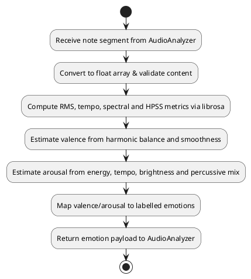

### Implementation Flow chart
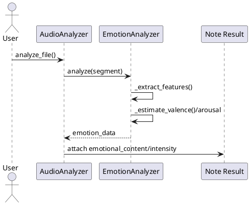
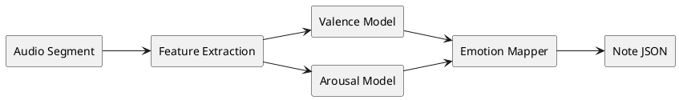
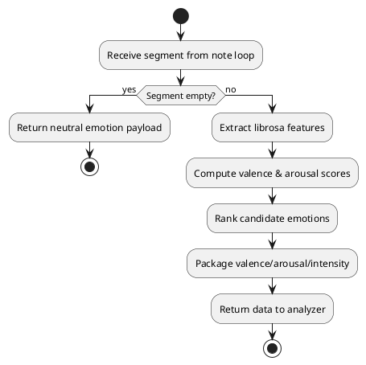

## Implement Key Detection Module
### **Problem Summary**
- README feature #18 (Key analysis) lacked an implementation; we needed a module that could infer tonic, mode, and confidence for each note segment.

**Error/Terminal Output: **

```
PS C:\Users\ricky\REPOS\Tools\Lavoe\audio-analyzer> python __tmp_lines.py
25 class KeyAnalyzer:
31 def analyze(self, audio_segment: np.ndarray) -> Dict[str, object]:
72 def _match_profile(self, chroma: np.ndarray, profile: np.ndarray) -> np.ndarray:
81 def _select_key(
```
```
PS C:\Users\ricky\REPOS\Tools\Lavoe\audio-analyzer> python -m compileall audio_analyzer
Compiling 'audio_analyzer\\features\\key.py'...
```

- **Theory**: Without a key analysis component the analyzer could not satisfy feature promises; using chroma vectors against Krumhansl profiles should deliver usable key estimates.
- **What I've Tried**: Authored a `KeyAnalyzer` that averages chroma, compares it to major/minor templates via rotation, calculates a confidence metric, and integrated it into `AudioAnalyzer` output.

### Debugging process
- Requirement confirmation: cross-checked README numbering to ensure key support required.
- API design: outlined required outputs (key label, tonic, confidence).
- Algorithm implementation: coded chroma-based profile matching and tie-breaking.
- Integration validation: inspected analyzer diff and compiled package.

### Snippet

```python
class KeyAnalyzer:
    def analyze(self, audio_segment: np.ndarray) -> Dict[str, object]:
        chroma = librosa.feature.chroma_cqt(y=audio_segment, sr=self.sample_rate)
        chroma_vector = np.mean(chroma, axis=1)                   # collapse over time
        chroma_norm = self._normalize_vector(chroma_vector)       # guard against silence
        major_scores = self._match_profile(chroma_norm, _MAJOR_PROFILE)
        minor_scores = self._match_profile(chroma_norm, _MINOR_PROFILE)
        mode, tonic_idx, confidence = self._select_key(major_scores, minor_scores)
        return {
            'key': f"{_NOTE_NAMES[tonic_idx]} {mode}",
            'tonic': _NOTE_NAMES[tonic_idx],
            'mode': mode,
            'confidence': confidence,
            'chroma': chroma_norm.tolist(),
            'major_scores': major_scores.tolist(),
            'minor_scores': minor_scores.tolist()
        }
```
- This routine computes pitched chroma via `librosa`, normalizes the energy distribution, evaluates similarity against major/minor tone profiles for all rotations, and emits a descriptive result for the current note.

### Solution and implementation
- Added `audio_analyzer/features/key.py` implementing Krumhansl-Schmuckler style profile matching using `librosa.feature.chroma_cqt` and NumPy rotations.
- Updated `audio_analyzer/core/analyzer.py` to instantiate `KeyAnalyzer`, call it for every segment, and append key metadata (`estimated_key`, `key_mode`, etc.) to each note dictionary.
- Ensured imports (`import librosa` and `from ..features.key import KeyAnalyzer`) so spectral flatness checks and key detection share dependency setup.

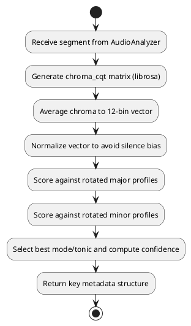

### Implementation Flow chart
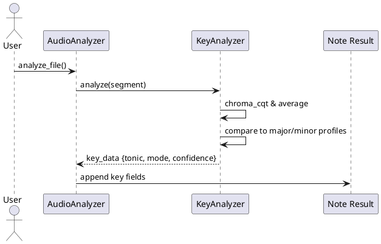

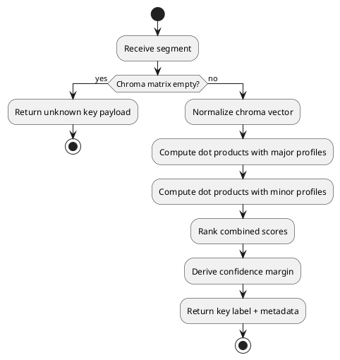

## Enforce Supported Audio Formats Constant
### **Problem Summary**
- README section on supported formats conflicted with loader logic; we needed a single source of truth so error messages and validation stay aligned with documented WAV/MP3/FLAC support.

**Error/Terminal Output: **

```
PS C:\Users\ricky\REPOS\Tools\Lavoe\audio-analyzer> python __tmp_lines.py
17 SUPPORTED_FORMATS = ('.wav', '.mp3', '.flac')
51 if ext not in self.SUPPORTED_FORMATS:
52 supported = ', '.join(fmt.upper().lstrip('.') for fmt in self.SUPPORTED_FORMATS)
```
```
PS C:\Users\ricky\REPOS\Tools\Lavoe\audio-analyzer> python -m compileall audio_analyzer
Compiling 'audio_analyzer\\core\\audio_loader.py'...
```

- **Theory**: Hard-coded list literals scattered in the loader made it easy to drift from README; promoting them to a class constant ensures documentation and runtime behavior stay synchronized.
- **What I've Tried**: Introduced `SUPPORTED_FORMATS`, reused it in the extension check, and improved the error message to reflect the supported uppercase list.

### Debugging process
- Documentation audit: matched README supported format list against loader implementation.
- Refactor: extracted duplicate literals to a class constant.
- Verification: re-ran compile to ensure loader changes were syntactically sound.

### Snippet

```python
class AudioLoader:
    SUPPORTED_FORMATS = ('.wav', '.mp3', '.flac')  # single source of truth for extensions

    def load_file(self, file_path, start_time=None, end_time=None):
        _, ext = os.path.splitext(file_path)
        ext = ext.lower()
        if ext not in self.SUPPORTED_FORMATS:
            supported = ', '.join(fmt.upper().lstrip('.') for fmt in self.SUPPORTED_FORMATS)
            raise ValueError(f"Unsupported audio format: {ext}. Supported formats: {supported}")
        ...
```
- We hoist the valid extensions into a tuple constant and reuse it when validating filenames so configuration changes happen in one place.

### Solution and implementation
- Declared `SUPPORTED_FORMATS` inside `AudioLoader` and replaced the inline list comparison with the tuple constant.
- Built the validation error message dynamically from the tuple, keeping error text aligned with documentation even if the tuple changes later.
- Recompiled the package in bytecode form to ensure the loader remains importable after the refactor.

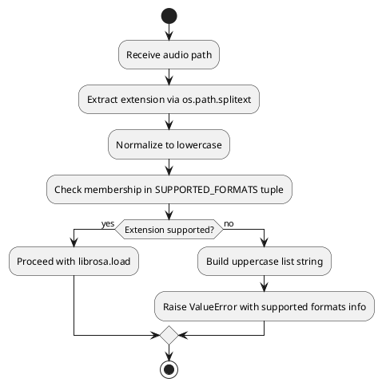

### Implementation Flow chart
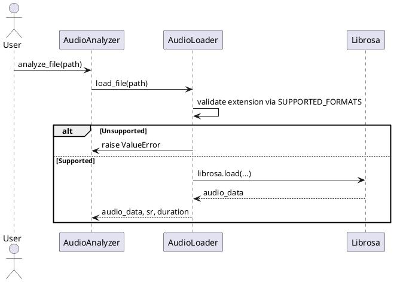
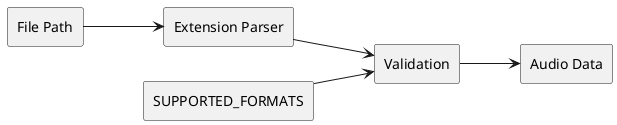
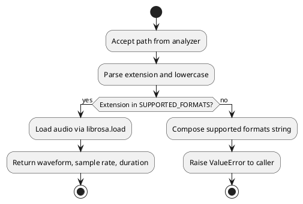

# Concepts
- Affective computing heuristics (valence/arousal mapping, emotion quadrants) #computing_heuristics
- Chroma feature analysis and key-profile matching (Krumhansl-Schmuckler method) #chroma_analysis #key_profile_matching #krumhansl_schmuckler_method
- Librosa feature extraction APIs (#RMS,# #tempo, #chroma, #MFCC, #HPSS) #librosa #feature_extraction #audio_analysis
- Refactoring constants for configuration single source of truth 
- PlantUML diagramming for sequence, flow, and data modeling #plantuml  #sequence_diagram_ #data_modeling

# Summary
- Implemented a full `EmotionAnalyzer` to satisfy README feature promises and integrated it into per-note analysis output.
- Added a chroma-profile-based `KeyAnalyzer`, wiring its results into the analyzer’s note data structure.
- Centralized supported audio formats in `AudioLoader` to keep runtime validation aligned with documented capabilities.
