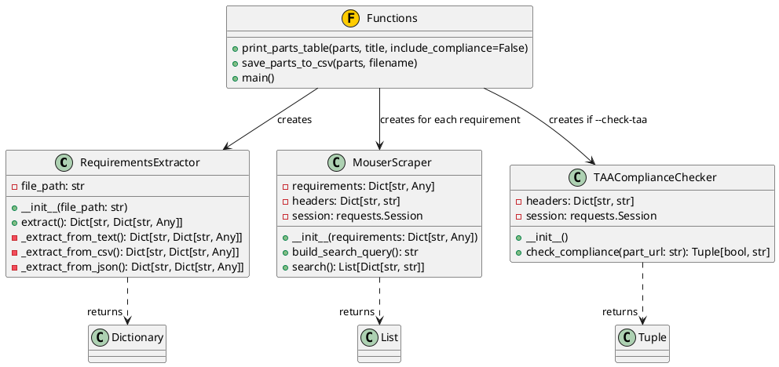
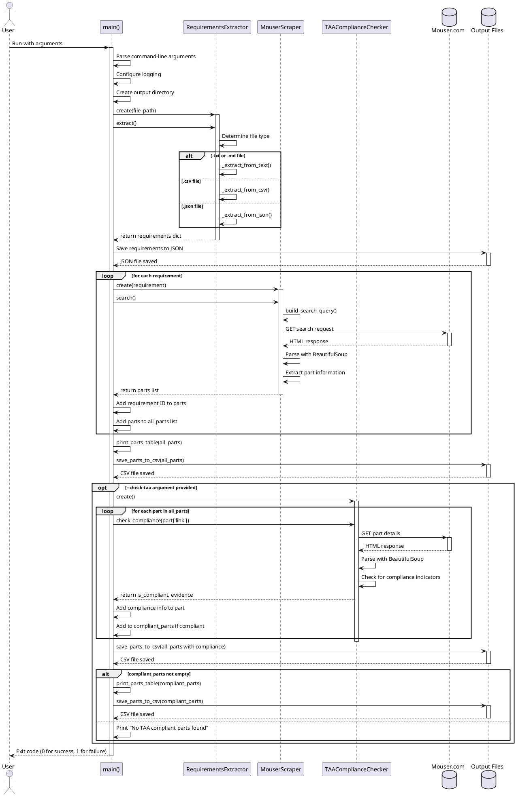
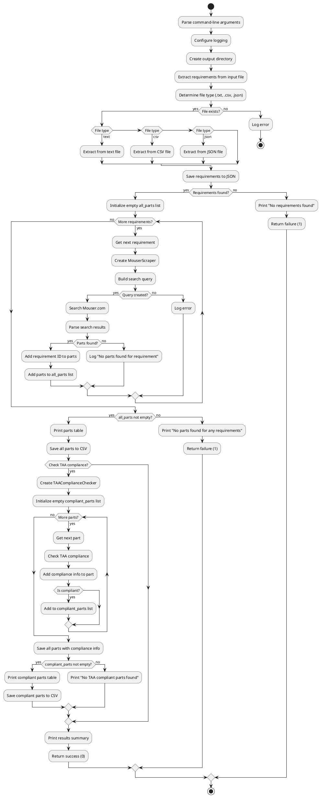
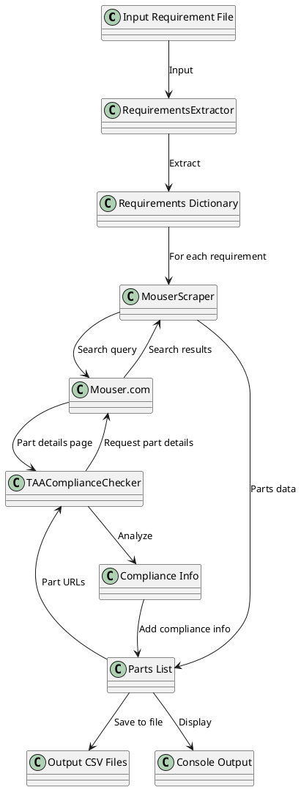

# Tapa Tool Architecture

This document provides detailed diagrams of the Tapa Tool's architecture and workflow using PlantUML.

## Overview

The Tapa Tool is designed to:
1. Extract parts requirements from specification documents
2. Search for matching parts on Mouser.com
3. Verify TAA compliance of found parts
4. Output TAA compliant parts to structured formats

## Class Structure



## Sequence Diagram



## Flowchart



## Data Flow



## Usage Example

The Tapa Tool is run from the command line with the following syntax:

```
python tapa_tool.py --input-file <requirements_file> [--output-dir <output_directory>] [--check-taa] [--verbose]
```

### Arguments

- `--input-file`: (Required) Path to input requirements document (.txt, .csv, or .json)
- `--output-dir`: (Optional) Directory for output files (defaults to "output")
- `--check-taa`: (Optional) Enable TAA compliance checking
- `--verbose`: (Optional) Enable verbose logging

### Output Files

The tool creates the following output files:
1. `requirements.json`: Extracted requirements in JSON format
2. `all_parts.csv`: All parts found for all requirements
3. `parts_with_compliance.csv`: All parts with TAA compliance information (if --check-taa used)
4. `taa_compliant_parts.csv`: Only TAA compliant parts (if --check-taa used)

## Implementation Details

### Requirements Extraction

- Supports multiple file formats:
  - Text files (.txt, .md): Uses regex to identify requirements
  - CSV files: Identifies ID columns and maps to requirements
  - JSON files: Handles multiple JSON structures

### Mouser Scraping

- Uses the requests library to query Mouser.com
- Parses HTML with BeautifulSoup4
- Builds search queries based on available requirement fields
- Extracts part names, numbers, and links

### TAA Compliance Checking

- Retrieves detailed part pages from Mouser.com
- Searches for TAA compliance indicators in page text
- Handles multiple TAA compliant countries and phrases
- Reports evidence for compliance determinations
