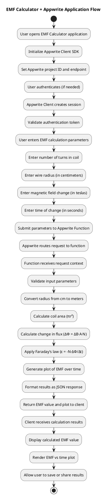
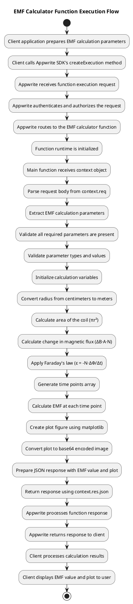
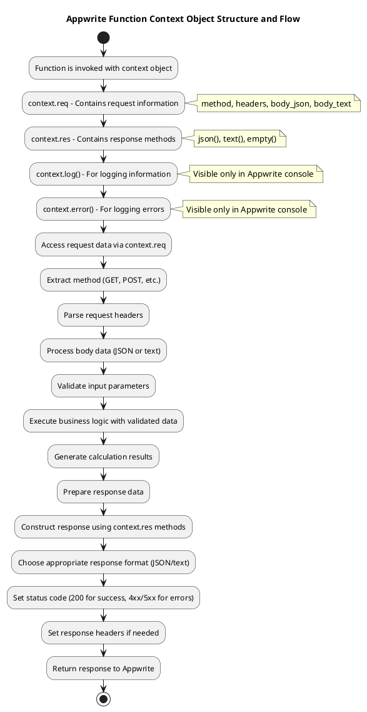
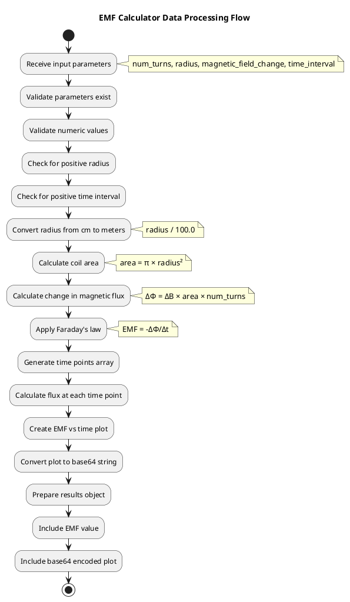
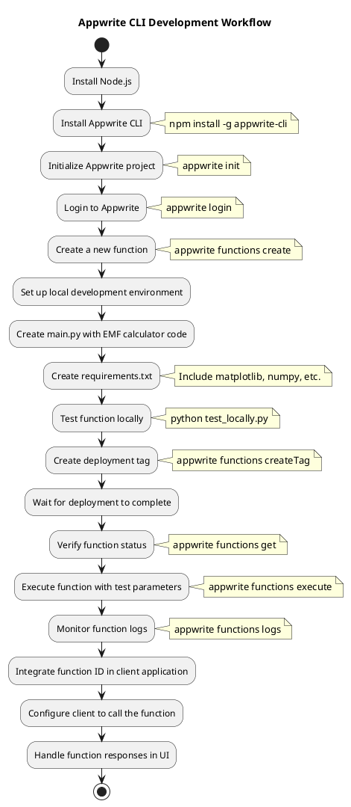

# Appwrite EMF Calculator Architecture - PlantUML Diagram

This document contains PlantUML code for visualizing the architecture of the Appwrite EMF calculator application.

## System Architecture Overview



## Function Execution Flow



## Context Object Structure



## EMF Calculator Data Flow



## Appwrite CLI Workflow



##  Python-based Appwrite Function Structure

This structural diagram describes the detailed process and architecture of the Python-based Appwrite function implementation for the EMF calculator. It illustrates the Python function's structure, components, and their interactions during the execution lifecycle.

```plantuml
@startuml Python Appwrite Function Structure

' Main Function Structure
package "EMF Calculator Function" as EMFFunction {
  class "Main Function" as MainFunction {
    + main(context)
    - validate_parameters(data)
    - calculate_emf(params)
    - generate_plot(time_points, emf_values)
    - create_response(emf, plot_b64)
  }

  class "Request Handler" as RequestHandler {
    + parse_request(context.req)
    + extract_body()
    + validate_content_type()
    - handle_json_body()
    - handle_form_data()
  }

  class "Parameter Validator" as ParamValidator {
    + validate_required_fields(data)
    + validate_numeric_values(data)
    + validate_positive_values(data)
    + convert_units(data)
  }

  class "EMF Calculator" as EMFCalculator {
    + calculate_area(radius)
    + calculate_flux_change(area, turns, field_change)
    + calculate_emf(flux_change, time)
    + generate_time_points(time_interval)
    + calculate_emf_over_time(flux_change, time_points)
  }

  class "Visualization Generator" as Visualizer {
    + create_plot(time_points, emf_values)
    + set_plot_style()
    + add_labels_and_title()
    + convert_to_base64()
  }

  class "Response Formatter" as ResponseFormatter {
    + create_success_response(emf, plot_b64)
    + create_error_response(message, status_code)
    + add_response_headers()
  }
}

' External Libraries
package "Python Libraries" as PythonLibs {
  class "NumPy" as NumPy {
    + array()
    + linspace()
    + pi
  }

  class "Matplotlib" as Matplotlib {
    + pyplot
    + Figure
    + savefig()
  }

  class "Base64" as Base64 {
    + b64encode()
    + b64decode()
  }

  class "JSON" as JSON {
    + dumps()
    + loads()
  }

  class "IO" as IO {
    + BytesIO
    + StringIO
  }
}

' Appwrite Runtime
package "Appwrite Function Runtime" as AppwriteRuntime {
  class "Context Object" as Context {
    + req
    + res
    + log()
    + error()
  }

  class "Request Object" as Request {
    + method
    + headers
    + query
    + body_raw
    + body_text
    + body_json
  }

  class "Response Methods" as Response {
    + json()
    + text()
    + send()
    + empty()
    + redirect()
  }
}

' Process Flow Relationships
MainFunction --> RequestHandler : "1. Passes context.req"
RequestHandler --> ParamValidator : "2. Sends extracted data"
ParamValidator --> EMFCalculator : "3. Provides validated parameters"
EMFCalculator --> NumPy : "4. Uses for calculations"
EMFCalculator --> Visualizer : "5. Passes calculation results"
Visualizer --> Matplotlib : "6. Creates visualization"
Visualizer --> IO : "7. Buffers plot data"
Visualizer --> Base64 : "8. Encodes plot image"
EMFCalculator --> ResponseFormatter : "9. Sends calculation results"
Visualizer --> ResponseFormatter : "10. Provides encoded plot"
ResponseFormatter --> JSON : "11. Formats response data"
ResponseFormatter --> Response : "12. Uses response methods"
Context --> MainFunction : "Provides execution context"
Context *-- Request : "Contains request data"
Context *-- Response : "Contains response methods"

' Error Handling Flows
RequestHandler ..> ResponseFormatter : "Error: Invalid request format"
ParamValidator ..> ResponseFormatter : "Error: Parameter validation failed"
EMFCalculator ..> ResponseFormatter : "Error: Calculation error"
Visualizer ..> ResponseFormatter : "Error: Plot generation failed"

note right of MainFunction
  Python Function Entry Point:
  
  def main(context):
      try:
          # Parse request data
          data = context.req.body_json
          
          # Validate parameters
          params = validate_parameters(data)
          
          # Calculate EMF
          emf, time_points, emf_values = calculate_emf(params)
          
          # Generate visualization
          plot_b64 = generate_plot(time_points, emf_values)
          
          # Return response
          return context.res.json(
              create_response(emf, plot_b64)
          )
      except Exception as e:
          context.error(str(e))
          return context.res.json(
              {"error": str(e)},
              status_code=400
          )
end note

note right of EMFCalculator
  EMF Calculation Process:
  
  1. Convert radius from cm to meters
  2. Calculate coil area: A = πr²
  3. Calculate flux change: ΔΦ = ΔB·A·N
  4. Apply Faraday's law: ε = -N·ΔΦ/Δt
  5. Generate time points array
  6. Calculate EMF at each time point
end note

@enduml
