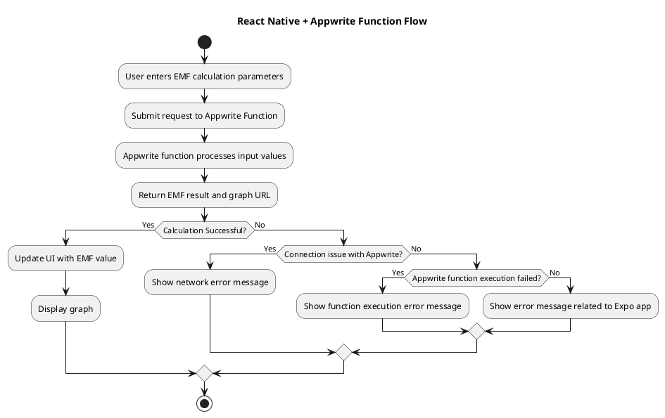

# Project Overview

- **Name**: Appwrite EMF Calculator
- **Framework**: React Native (Expo)
- **UI Components**: React Native built-in components, Expo Image Picker, and Appwrite SDK

## Description

The Appwrite EMF Calculator is a mobile application that allows users to input parameters related to electromagnetic induction and compute the induced electromotive force (EMF) using an Appwrite cloud function. The app provides a smooth user experience with real-time feedback on calculations and graphical visualization of results.

## Design Specifics

### EMF Calculator Screen

- This will send parameters over to an Appwrite function that uses a Python script to perform the calculation. The result will be returned and displayed in the app.

##### Input parameters:

- **N**: Number of turns
- **r**: Radius of coil
- **B1**: Initial magnetic field
- **B2**: Final magnetic field
- **t**: Time interval

##### Output parameters:

- **EMF**: Induced electromotive force
- **EMF Plot**: Graph of EMF over time

### Features

1. **Input Form**

   - Users enter values for the required parameters.

2. **Calling an Appwrite Function**

   - The input values are sent to an Appwrite Function that processes the input values.

3. **EMF Calculation (Server-side with Appwrite Functions)**

   - The function applies the formula for EMF:

     \(EMF = -N \frac{(B2 - B1)}{t}\)

   - Generates an EMF vs. Time graph.
   - Returns the computed EMF and the plot URL.

4. **Displaying Results**

   - The app receives the calculated EMF value and plot image.
   - Updates the UI with the numerical result and graph.

### JavaScript Functions Used

- `handleInputChange()`: Updates state with user-provided values.
- `callAppwriteFunction()`: Sends input data to Appwrite Function for processing.
- `fetchEMFResult()`: Retrieves the computed EMF and updates the UI.

### General Design Notes

- **Layout**: The app follows a clean, minimalistic vertical scroll design with an input form at the top and results displayed below.
- **Typography**: Uses a consistent font style with bold headers and easy-to-read text for input fields and results.
- **Interactivity**: Responsive buttons for submitting calculations and interactive graph displays.
- **Color Scheme**: A simple, light theme with accent colors for action buttons.
- **Error Handling**:
  - Implement error handling for invalid input values.
  - Show alerts for network errors or function call failures.
  - Check if the Appwrite function is being called (i.e., connection issue detection).
  - Implement a ping mechanism to verify the connection between the app and the backend.
  - Differentiate errors between Appwrite connection, function execution, and Expo app issues.
- **Data Fetching in Components**:
  - Uses React hooks (`useEffect`, `useState`) to manage API calls.
  - Implements loading states while fetching EMF results.
  - Displays error messages if calculation fails.

## Components

### InputForm Component

- **Purpose**: Collects input values from the user.
- **Implementation**:
  - Uses React Native TextInput fields for input.
  - Includes a submit button to trigger calculations.

### CalculateButton Component

- **Purpose**: Sends input data to Appwrite Function.
- **Implementation**:
  - Calls `callAppwriteFunction()` with input parameters.
  - Displays a loading indicator while processing.
  - Retrieves and displays the result.

### EMFResult Component

- **Purpose**: Displays the computed EMF value.
- **Implementation**:
  - Uses `fetchEMFResult()` to retrieve and show results.
  - Displays an error message if the calculation fails.

### EMFGraph Component

- **Purpose**: Displays the EMF vs. Time graph.
- **Implementation**:
  - Fetches and renders the graph image.
  - Allows users to zoom and interact with the graph.

## Documentation

### Example Code for Sending Calculation Request

```javascript
const callAppwriteFunction = async (inputParams) => {
  try {
    const functionResponse = await client.functions.createExecution(
      '[FUNCTION-ID]',
      JSON.stringify(inputParams)
    );
    
    const result = JSON.parse(functionResponse.responseBody);
    return result;
  } catch (error) {
    console.error('Function call failed:', error);
  }
};
```

## Appwrite Functions Reference
- Appwrite Functions offer a familiar interface if you've developed REST endpoints. Each function is handled following a request and response pattern.

### [Lifecycle](https://appwrite.io/docs/products/functions/develop#life-cycle)

There is a clear lifecycle for all Appwrite Functions, from beginning to end. Here's everything that happens during a function execution.

1. The function is invoked.
    
2. The active [deployment](https://appwrite.io/docs/products/functions/deployments)'s executor will handle the request.
    
3. The Executor passes in request information like headers, body or path through the context.req object of your exported function.
    
4. The runtime executes the code you defined, you can log through the context.log() or context.error() methods.
    
5. Function terminates when you return results using return context.res.text(), return context.res.json() or similar.
    

[Locally developed functions](https://appwrite.io/docs/products/functions/develop-locally) follow the same lifecycle on your local machine.

### Entrypoint
- You'll find all of these steps in a simple function like this. Notice the exported entry point that the executor will call.

``` Python
from appwrite.client import Client
import os


# This is your Appwrite function
# It's executed each time we get a request
def main(context):
    # Why not try the Appwrite SDK?
    #
    # Set project and set API key
    # client = (
    #     Client()
    #        .set_project(os.environ["APPWRITE_FUNCTION_PROJECT_ID"])
    #        .set_key(context.req.headers["x-appwrite-key"])
    # )

    # You can log messages to the console
    context.log("Hello, Logs!")

    # If something goes wrong, log an error
    context.error("Hello, Errors!")

    # The `context.req` object contains the request data
    if context.req.method == "GET":
        # Send a response with the res object helpers
        # `context.res.text()` dispatches a string back to the client
        return context.res.text("Hello, World!")

    # `context.res.json()` is a handy helper for sending JSON
    return context.res.json({
        "motto": "Build like a team of hundreds_",
        "learn": "https://appwrite.io/docs",
        "connect": "https://appwrite.io/discord",
        "getInspired": "https://builtwith.appwrite.io",
    })


```

### Context Object
- Context is an object passed into every function to handle communication to both the end users, and logging to the Appwrite Console. All input, output, and logging **must be handled through the context object** passed in. You'll find these properties in the context object.

| req     | Contains request information like method, body, and headers. See full examples [in the request section](https://appwrite.io/docs/products/functions/develop#request)                                      |
| ------- | --------------------------------------------------------------------------------------------------------------------------------------------------------------------------------------------------------- |
| log()   | Method to log information to the Appwrite Console, end users will not be able to see these logs. See full examples [in the logging section](https://appwrite.io/docs/products/functions/develop#logging). |
| error() | Method to log errors to the Appwrite Console, end users will not be able to see these errors. See full examples [in the logging section](https://appwrite.io/docs/products/functions/develop#logging).    |
|         |                                                                                                                                                                                                           |
| res     | Contains methods to build a response and return information. See full examples [in the response section](https://appwrite.io/docs/products/functions/develop#response)                                    |

### Request
If you pass data into an Appwrite Function, it'll be found in the request object. This includes all invocation inputs from Appwrite SDKs, HTTP calls, Appwrite events, or browsers visiting the configured domain. Explore the request object with the following function, which logs all request params to the Appwrite Console.


| req.bodyText   | Returns text that has been converted from binary data. |
| -------------- | ------------------------------------------------------ |
| req.bodyJson   | Parses the body text as JSON.                          |
| req.bodyBinary | Returns the binary body.                               |

```
import json

def main(context):
    context.log(context.req.body_text)             # Raw request body, contains request data
    context.log(json.dumps(context.req.body_json)) # Object from parsed JSON request body, otherwise string
    context.log(json.dumps(context.req.headers))   # String key-value pairs of all request headers, keys are lowercase
    context.log(context.req.scheme)                # Value of the x-forwarded-proto header, usually http or https
    context.log(context.req.method)                # Request method, such as GET, POST, PUT, DELETE, PATCH, etc.
    context.log(context.req.url)                   # Full URL, for example: http://awesome.appwrite.io:8000/v1/hooks?limit=12&offset=50
    context.log(context.req.host)                  # Hostname from the host header, such as awesome.appwrite.io
    context.log(context.req.port)                  # Port from the host header, for example 8000
    context.log(context.req.path)                  # Path part of URL, for example /v1/hooks
    context.log(context.req.query_string)          # Raw query params string. For example "limit=12&offset=50"
    context.log(json.dumps(context.req.query))     # Parsed query params. For example, req.query.limit

    return context.res.text("All the request parameters are logged to the Appwrite Console.")

```


### [Response](https://appwrite.io/docs/products/functions/develop#response)

Use the response object to send a response to the function caller. This could be a user, client app, or an integration. The response information **will not be logged** to the Appwrite Console. There are several possible ways to send a response, explore them in the following Appwrite Function.

#### [Response types](https://appwrite.io/docs/products/functions/develop#response-types)

|Response|Description|
|---|---|
|empty|Sends a response with a code 204 No Content status.|
|json|Converts the data into a JSON string and sets the content-type header to application/json.|
|binary|Packages binary bytes, the status code, and the headers into an object.|
|redirect|Redirects the client to the specified URL link.|
|text|Converts the body using UTF-8 encoding into a binary Buffer.|

```

def main(context):
    type = context.req.query['type']

    if type == 'empty':
        return context.res.empty()
    elif type == 'json':
        return context.res.json({"type": "This is a JSON response"})
    elif type == 'binary':
        with open('file.png', 'rb') as file:
            file_contents = file.read()
        return context.res.binary(file_contents)
    elif type == 'redirect':
        return context.res.redirect("https://appwrite.io", 301)
    elif type == 'html':
        return context.res.text("<h1>This is an HTML response</h1>", 200, {
            "content-type": "text/html"
        })
    else:
        return context.res.text("This is a text response")

```

To get the different response types, set one of the following query parameters in the [generated domain](https://appwrite.io/docs/products/functions/domains) of your function.

|Type|Query Param|Example|
|---|---|---|
|text|/?type=text|https://64d4d22db370ae41a32e.appwrite.global/?type=text|
|json|/?type=json|https://64d4d22db370ae41a32e.appwrite.global/?type=json|
|redirect|/?type=redirect|https://64d4d22db370ae41a32e.appwrite.global/?type=redirect|
|html|/?type=html|https://64d4d22db370ae41a32e.appwrite.global/?type=html|
|empty|/|https://64d4d22db370ae41a32e.appwrite.global/|
---

## PlantUML Code for Flowchart



